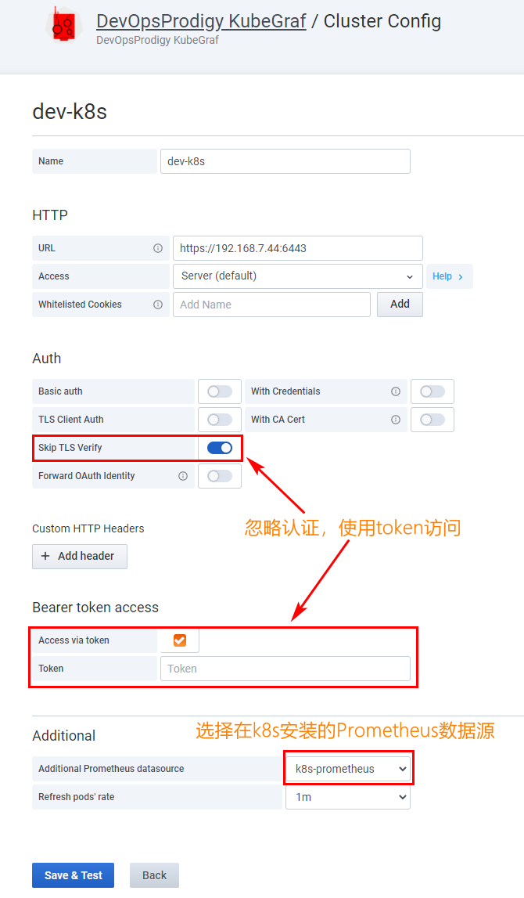
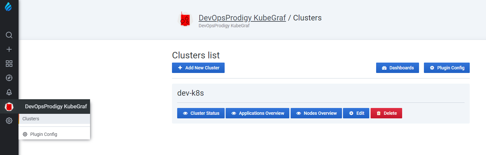
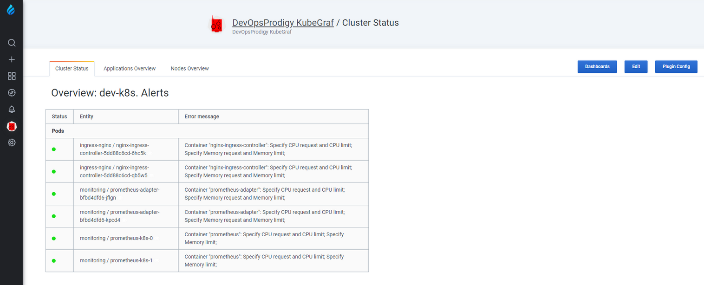
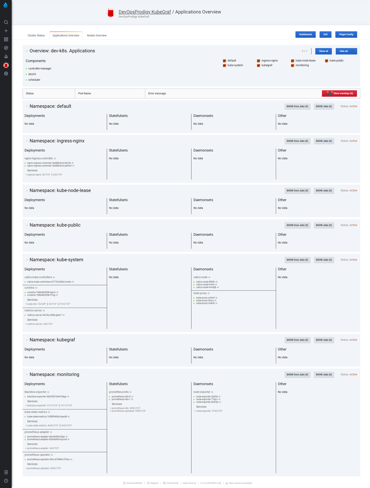
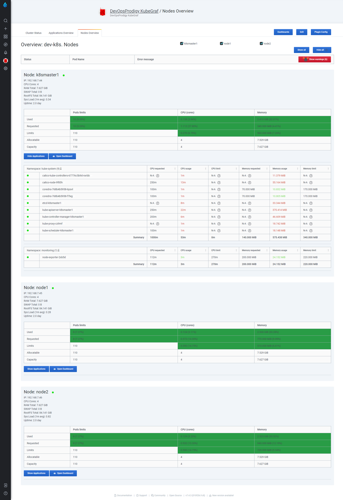

## 安装k8s监控

```
# grafana-kubegraf用户授予权限
kubectl apple -f kubegraf/

# 安装CRD和prometheus-operator
kubectl apple -f kube-monitor/1_CRD_prometheus-operator

# 安装prometheus
kubectl apple -f kube-monitor/2_prometheus

# 安装k8s组件监控
kubectl apple -f kube-monitor/3_k8s-module

# 安装状态指标监控
kubectl apple -f kube-monitor/4_kube-state-metrics

# 安装节点监控
kubectl apple -f kube-monitor/5_node-exporter

# 安装blackbox(可选)
kubectl apple -f kube-monitor/6_blackbox-exporter

# 安装alert manager(可选)
kubectl apple -f kube-monitor/7_alertmanager

# 安装grafana(可选)
kubectl apple -f kube-monitor/8_grafana

# 查看所有pod是否安装成功
kubectl get pod -n monitoring
```

安装完成后，访问prometheus(例如 http://节点ip:30990 )，检查所有targets的状态是否都是up。

<br>

## 在集群外安装grafana和k8s插件

使用docker安装grafana，切换到grafana文件夹

> docker-compose up -d

打开grafana( http://ip:3000 )主页，默认账号和密码都是admin

<br>

**安装插件和配置**

(1) 进入grafan容器

> docker exec -it grafana bash

(2) 在容器安装插件kubegraf和饼图插件

```bash
grafana-cli plugins install devopsprodigy-kubegraf-app
grafana-cli plugins install grafana-piechart-panel
```

(3) 重启grafana

> docker-compose down && docker-compose up -d

(4) 获取k8s集群访问令牌

> kubectl get secret grafana-kubegraf-secret -o jsonpath={.data.token} -n kubegraf | base64 -d

(5) 获取访问k8s的api的url
	
> kubectl cluster-info

(6) 添加prometheus数据源

点击grafana左边菜单栏设置 --> 选择Data Source --> add data source --> 选择prometheus --> url填写指向k8s的prometheus(例如http://192.168.7.44:30990/)。

(7) 点击grafana左边菜单DevOpsProdigy KubeGraf，点击plugin config，然后点击enable，启用插件
	
(8) 插件支持配置多个k8s集群，点击cluster，点击add new cluster，创建集群，填写url、开启Skip TLS Verify，填写token，选择配置好的指向k8s的prometheus数据源，如下图所示：



<br>

## k8s监控展示

已监控的k8s集群列表，如果有多个k8s集群，配置地址即可



<br>

查看集群状态界面



<br>

查看集群资源概览界面，点击pod，可以查看具体的监控图表



<br>

查看集群节点概览界面，点击open dashboard，查看具体监控图表



<br>

参考：

- https://github.com/devopsprodigy/kubegraf
- https://github.com/prometheus-operator/kube-prometheus

